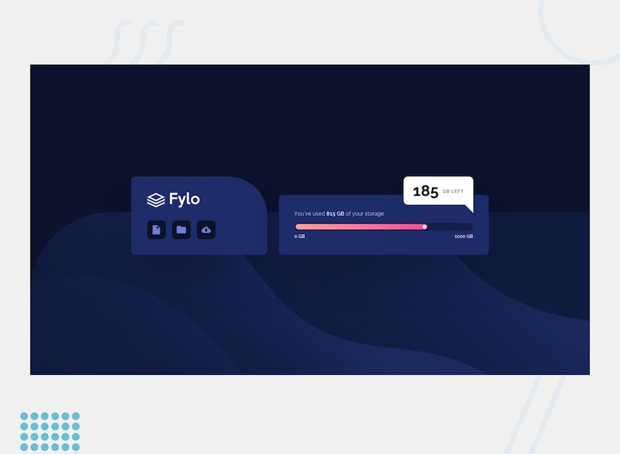

# Escuela de Desarrollo Web by Platzi - Platzi Web Challenge

https://cristianiniguez.github.io/platziwebchallenge/index.html

## Semana 1 - Huddle landing page with single introductory section

Página: https://cristianiniguez.github.io/platziwebchallenge/semana_1/

Repositorio: https://github.com/cristianiniguez/platziwebchallenge/tree/master/semana_1

## Semana 2 - Article preview component

Página: https://cristianiniguez.github.io/platziwebchallenge/semana_2/

Repositorio: https://github.com/cristianiniguez/platziwebchallenge/tree/master/semana_2

## Semana 3 - Four card feature section

Página: https://cristianiniguez.github.io/platziwebchallenge/semana_3/

Repositorio: https://github.com/cristianiniguez/platziwebchallenge/tree/master/semana_3

## Semana 4 - Coding Bootcamp Testimonials Slider

Página: https://cristianiniguez.github.io/platziwebchallenge/semana_4/

Repositorio: https://github.com/cristianiniguez/platziwebchallenge/tree/master/semana_4

## Semana 5 - Fylo data storage component

Página: https://cristianiniguez.github.io/platziwebchallenge/semana_5/

Repositorio: https://github.com/cristianiniguez/platziwebchallenge/tree/master/semana_5

## Semana 6 - Room homepage

Página: https://cristianiniguez.github.io/platziwebchallenge/semana_6/

Repositorio: https://github.com/cristianiniguez/platziwebchallenge/tree/master/semana_6

